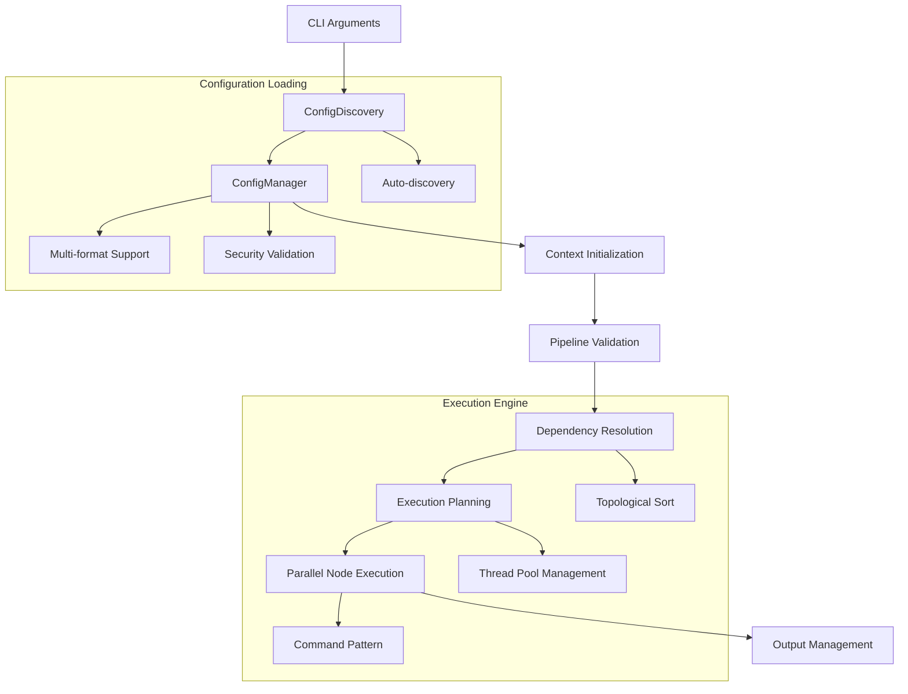

# Tauro Framework - Documentación Técnica

## Tabla de Contenidos

1. [Visión General](#visión-general)
2. [Arquitectura del Sistema](#arquitectura-del-sistema)
3. [Módulos Principales](#módulos-principales)
4. [Configuración](#configuración)
5. [Ejecución de Pipelines](#ejecución-de-pipelines)
6. [API Reference](#api-reference)
7. [Desarrollo y Extensión](#desarrollo-y-extensión)
8. [Mejores Prácticas](#mejores-prácticas)
9. [Troubleshooting](#troubleshooting)

## Visión General

Tauro es un framework de ejecución de pipelines de datos escalable que soporta tanto flujos de trabajo tradicionales como de Machine Learning. Está diseñado para manejar dependencias complejas, ejecución paralela y múltiples entornos de despliegue.

### Características Principales

- **Resolución automática de dependencias** mediante algoritmos de ordenamiento topológico
- **Ejecución paralela inteligente** respetando el grafo de dependencias
- **Soporte multi-formato** de configuración (YAML, JSON, DSL personalizado)
- **Integración Spark** para local y Databricks
- **Pipelines especializados** para ML con soporte de hiperparámetros
- **Validación robusta** de configuraciones y esquemas de datos

## Arquitectura del Sistema

```
tauro/
├── cli/                    # Interfaz de línea de comandos
│   ├── cli.py             # Clase principal TauroCLI
│   ├── config.py          # Gestión y descubrimiento de configuración
│   ├── core.py            # Tipos de datos centrales y errores
│   └── execution.py       # Inicialización de contexto y wrapper de ejecución
├── exec/                   # Motor de ejecución de pipelines
│   ├── commands.py        # Patrón Command para nodos
│   ├── dependency_resolver.py # Resolución de dependencias
│   ├── executor.py        # Coordinador principal de pipeline
│   ├── node_executor.py   # Ejecutor de nodos con paralelismo
│   └── pipeline_validator.py # Validadores de pipeline
└── config/                # Sistema de configuración
    ├── context.py         # Contexto principal de aplicación
    ├── loaders.py         # Factory y loaders de configuración
    ├── session.py         # Factory de sesiones Spark
    └── validators.py      # Validadores de configuración
```

### Flujo de Datos



## Módulos Principales

### 1. CLI Module (`tauro.cli`)

#### TauroCLI
Clase principal que coordina la ejecución completa.

```python
from tauro.cli import TauroCLI

cli = TauroCLI()
exit_code = cli.run([
    "--env", "dev",
    "--pipeline", "data_processing",
    "--start-date", "2024-01-01",
    "--end-date", "2024-01-31"
])
```

#### ConfigDiscovery
Descubre automáticamente archivos de configuración en el árbol de directorios.

```python
from tauro.cli.config import ConfigDiscovery

discovery = ConfigDiscovery("/path/to/project")
configs = discovery.discover(max_depth=3)

# Búsqueda inteligente con criterios
best_match = discovery.find_best_match(
    layer_name="golden_layer",
    use_case="clustering_analysis",
    config_type="yaml"
)
```

#### ConfigManager
Gestiona la carga de configuraciones en múltiples formatos.

```python
from tauro.cli.config import ConfigManager

manager = ConfigManager(
    base_path="/project/configs",
    layer_name="processing_layer",
    interactive=True
)

# Cambio seguro al directorio de configuración
manager.change_to_config_directory()

# Creación de loader apropiado
loader = manager.create_loader()
```

### 2. Execution Module (`tauro.exec`)

#### PipelineExecutor
Coordinador principal para la ejecución de pipelines.

```python
from tauro.exec import PipelineExecutor
from tauro.config import Context

context = Context(...)
executor = PipelineExecutor(context)

# Ejecución completa de pipeline
executor.run_pipeline(
    pipeline_name="etl_pipeline",
    start_date="2024-01-01",
    end_date="2024-01-31"
)

# Ejecución de nodo específico
executor.run_pipeline(
    pipeline_name="etl_pipeline",
    node_name="transform_data",
    start_date="2024-01-01",
    end_date="2024-01-31"
)
```

#### DependencyResolver
Resuelve dependencias entre nodos usando ordenamiento topológico.

```python
from tauro.exec.dependency_resolver import DependencyResolver

# Construcción del grafo de dependencias
dag = DependencyResolver.build_dependency_graph(
    pipeline_nodes=["extract", "transform", "load"],
    node_configs=node_configurations
)

# Ordenamiento topológico
execution_order = DependencyResolver.topological_sort(dag)
# Resultado: ["extract", "transform", "load"]
```

#### NodeExecutor
Maneja la ejecución paralela de nodos respetando dependencias.

```python
from tauro.exec.node_executor import NodeExecutor

executor = NodeExecutor(context, input_loader, output_manager, max_workers=4)

# Ejecución paralela con gestión de dependencias
executor.execute_nodes_parallel(
    execution_order=["node1", "node2", "node3"],
    node_configs=configs,
    dag=dependency_graph,
    start_date="2024-01-01",
    end_date="2024-01-31",
    ml_info={}
)
```

### 3. Config Module (`tauro.config`)

#### Context
Contexto central que contiene todas las configuraciones del sistema.

```python
from tauro.config import Context

# Inicialización desde archivos separados
context = Context(
    global_settings="conf/global.yaml",
    pipelines_config="conf/pipelines.yaml",
    nodes_config="conf/nodes.yaml",
    input_config="conf/inputs.yaml",
    output_config="conf/outputs.yaml"
)

# Inicialización desde configuración JSON unificada
context = Context.from_json_config(
    global_settings=global_dict,
    pipelines_config=pipelines_dict,
    nodes_config=nodes_dict,
    input_config=inputs_dict,
    output_config=outputs_dict
)

# Acceso a pipelines
pipeline = context.get_pipeline("my_pipeline")
all_pipelines = context.list_pipeline_names()
```

#### SparkSessionFactory
Factory para crear sesiones Spark según el modo de ejecución.

```python
from tauro.config.session import SparkSessionFactory

# Sesión local
spark_local = SparkSessionFactory.create_session("local")

# Sesión Databricks (requiere configuración)
spark_databricks = SparkSessionFactory.create_session("databricks")
```

## Configuración

### Formatos Soportados

#### 1. YAML Configuration
```yaml
# settings_yml.json
env_config:
  base:
    global_settings_path: "conf/global.yaml"
    pipelines_config_path: "conf/pipelines.yaml"
  dev:
    nodes_config_path: "conf/nodes_dev.yaml"
    input_config_path: "conf/inputs_dev.yaml"
    output_config_path: "conf/outputs_dev.yaml"
```

#### 2. JSON Configuration
```json
{
  "env_config": {
    "base": {
      "config_path": "conf/unified_config.json"
    },
    "dev": {
      "config_path": "conf/dev_config.json"
    }
  }
}
```

#### 3. DSL Configuration
```
# settings_dsl.json
base_path = "/project/configs"
environment = "dev"
max_parallel_nodes = 4
debug_mode = true
allowed_formats = ["parquet", "delta"]
```

### Estructura de Configuración de Pipeline

```yaml
# pipelines.yaml
data_processing:
  description: "Pipeline de procesamiento de datos principal"
  nodes:
    - extract_data
    - transform_data
    - validate_data
    - load_data
  inputs:
    - raw_data
  outputs:
    - processed_data

ml_training:
  description: "Pipeline de entrenamiento ML"
  nodes:
    - feature_engineering
    - model_training
    - model_validation
```

### Configuración de Nodos

```yaml
# nodes.yaml
extract_data:
  module: "pipelines.extraction.extractors"
  function: "extract_customer_data"
  dependencies: []

transform_data:
  module: "pipelines.transformation.transformers"
  function: "transform_customer_features"
  dependencies:
    - extract_data

model_training:
  module: "ml.training.trainers"
  function: "train_classification_model"
  dependencies:
    - feature_engineering
  ml_config:
    hyperparams:
      learning_rate: 0.01
      max_depth: 10
```

## Ejecución de Pipelines

### Comandos CLI Básicos

```bash
# Ejecución básica
tauro --env dev --pipeline data_processing

# Con rango de fechas específico
tauro --env prod --pipeline etl \
      --start-date 2024-01-01 \
      --end-date 2024-01-31

# Nodo específico
tauro --env dev --pipeline ml_training --node feature_engineering

# Modo interactivo para selección de configuración
tauro --env dev --pipeline test --interactive

# Validación sin ejecución
tauro --env dev --pipeline test --validate-only

# Dry run (muestra plan de ejecución)
tauro --env dev --pipeline test --dry-run
```

### Comandos de Información

```bash
# Listar configuraciones disponibles
tauro --list-configs

# Listar pipelines disponibles
tauro --list-pipelines

# Información de pipeline específico
tauro --pipeline-info data_processing

# Limpiar cache de configuración
tauro --clear-cache
```

### Ejemplo de Implementación de Nodo

```python
# pipelines/transformation/transformers.py
import pandas as pd
from typing import List

def transform_customer_features(
    raw_df: pd.DataFrame,
    start_date: str,
    end_date: str
) -> pd.DataFrame:
    """
    Transforma características de clientes.

    Args:
        raw_df: DataFrame con datos crudos
        start_date: Fecha de inicio del rango
        end_date: Fecha de fin del rango

    Returns:
        DataFrame transformado
    """
    # Filtrar por rango de fechas
    df_filtered = raw_df[
        (raw_df['date'] >= start_date) &
        (raw_df['date'] <= end_date)
    ]

    # Aplicar transformaciones
    df_transformed = df_filtered.copy()
    df_transformed['age_group'] = pd.cut(
        df_transformed['age'],
        bins=[0, 25, 45, 65, 100],
        labels=['young', 'adult', 'middle_age', 'senior']
    )

    return df_transformed
```

### Ejemplo de Nodo ML

```python
# ml/training/trainers.py
from sklearn.ensemble import RandomForestClassifier
import mlflow

def train_classification_model(
    features_df: pd.DataFrame,
    start_date: str,
    end_date: str
) -> pd.DataFrame:
    """
    Entrena modelo de clasificación con MLflow tracking.
    """
    with mlflow.start_run():
        # Obtener hiperparámetros del contexto Spark
        spark = SparkSession.getActiveSession()
        learning_rate = float(spark.conf.get("ml.hyperparams.learning_rate", "0.01"))
        max_depth = int(spark.conf.get("ml.hyperparams.max_depth", "10"))

        # Preparar datos
        X = features_df.drop(['target'], axis=1)
        y = features_df['target']

        # Entrenar modelo
        model = RandomForestClassifier(
            max_depth=max_depth,
            n_estimators=100,
            random_state=42
        )
        model.fit(X, y)

        # Log métricas
        score = model.score(X, y)
        mlflow.log_metric("accuracy", score)
        mlflow.log_param("max_depth", max_depth)

        # Retornar resultados
        predictions = model.predict(X)
        result_df = features_df.copy()
        result_df['predictions'] = predictions

        return result_df
```

## API Reference

### Core Classes

#### CLIConfig
```python
@dataclass
class CLIConfig:
    env: str
    pipeline: str
    node: Optional[str] = None
    start_date: Optional[str] = None
    end_date: Optional[str] = None
    base_path: Optional[str] = None
    layer_name: Optional[str] = None
    use_case_name: Optional[str] = None
    config_type: Optional[str] = None
    interactive: bool = False
    list_configs: bool = False
    log_level: str = "INFO"
    log_file: Optional[str] = None
    validate_only: bool = False
    dry_run: bool = False
    verbose: bool = False
    quiet: bool = False
```

#### Context
```python
class Context:
    def __init__(
        self,
        global_settings: Union[str, Dict],
        pipelines_config: Union[str, Dict],
        nodes_config: Union[str, Dict],
        input_config: Union[str, Dict],
        output_config: Union[str, Dict],
    )

    @property
    def pipelines(self) -> Dict[str, Dict[str, Any]]

    def get_pipeline(self, name: str) -> Optional[Dict[str, Any]]

    def list_pipeline_names(self) -> List[str]

    @classmethod
    def from_json_config(cls, ...) -> "Context"

    @classmethod
    def from_python_dsl(cls, python_module_path: str) -> "Context"
```

### Command Classes

#### NodeCommand
```python
class NodeCommand(Command):
    def __init__(
        self,
        function: Callable,
        input_dfs: List[Any],
        start_date: str,
        end_date: str,
        node_name: str,
    )

    def execute(self) -> Any
```

#### MLNodeCommand
```python
class MLNodeCommand(NodeCommand):
    def __init__(
        self,
        function: Callable,
        input_dfs: List[Any],
        start_date: str,
        end_date: str,
        node_name: str,
        model_version: str,
        hyperparams: Optional[Dict[str, Any]] = None,
        spark=None,
    )
```

### Exception Hierarchy

```python
class TauroError(Exception):
    def __init__(self, message: str, exit_code: ExitCode = ExitCode.GENERAL_ERROR)

class ConfigurationError(TauroError):
    """Errores de configuración inválida o faltante"""

class ValidationError(TauroError):
    """Errores de validación de entrada"""

class ExecutionError(TauroError):
    """Errores durante la ejecución del pipeline"""

class SecurityError(TauroError):
    """Errores de validación de seguridad"""
```

## Desarrollo y Extensión

### Creando Nuevos Loaders de Configuración

```python
from tauro.config.loaders import ConfigLoader

class CustomConfigLoader(ConfigLoader):
    def can_load(self, source: Union[str, Path]) -> bool:
        return Path(source).suffix.lower() == ".custom"

    def load(self, source: Union[str, Path]) -> Dict[str, Any]:
        # Implementar lógica de carga personalizada
        with open(source, 'r') as f:
            return self.parse_custom_format(f.read())

    def parse_custom_format(self, content: str) -> Dict[str, Any]:
        # Lógica de parsing específica
        pass

# Registrar el loader
factory = ConfigLoaderFactory()
factory._loaders.append(CustomConfigLoader())
```

### Extendiendo Validadores

```python
from tauro.config.validators import ConfigValidator

class CustomValidator(ConfigValidator):
    @staticmethod
    def validate_business_rules(config: Dict[str, Any]) -> None:
        """Validaciones específicas del negocio"""
        if config.get('environment') == 'prod':
            if not config.get('backup_enabled'):
                raise ConfigValidationError(
                    "Backup must be enabled in production"
                )
```

### Implementando Nuevos Tipos de Command

```python
from tauro.exec.commands import Command

class BatchCommand(Command):
    def __init__(self, batch_size: int, *args, **kwargs):
        super().__init__(*args, **kwargs)
        self.batch_size = batch_size

    def execute(self) -> Any:
        # Lógica de procesamiento por lotes
        results = []
        for batch in self.create_batches():
            result = self.process_batch(batch)
            results.append(result)
        return self.combine_results(results)
```

## Mejores Prácticas

### 1. Estructura de Proyecto Recomendada

```
project/
├── conf/                   # Configuraciones
│   ├── settings_yml.json  # Configuración principal
│   ├── global.yaml        # Configuración global
│   ├── pipelines.yaml     # Definición de pipelines
│   ├── nodes.yaml         # Configuración de nodos
│   ├── inputs.yaml        # Configuración de inputs
│   └── outputs.yaml       # Configuración de outputs
├── pipelines/             # Código de pipelines
│   ├── extraction/
│   ├── transformation/
│   └── loading/
├── ml/                    # Código ML específico
│   ├── features/
│   ├── training/
│   └── inference/
├── tests/                 # Tests
└── logs/                  # Logs de ejecución
```

### 2. Configuración de Logging

```python
# Configuración avanzada de logging
LoggerManager.setup(
    level="INFO",
    log_file="logs/tauro.log",
    verbose=False,
    quiet=False
)

# En código de nodos
from loguru import logger

def my_transform_function(df, start_date, end_date):
    logger.info(f"Processing {len(df)} records")
    logger.debug(f"Date range: {start_date} to {end_date}")

    try:
        result = process_data(df)
        logger.success("Transformation completed successfully")
        return result
    except Exception as e:
        logger.error(f"Transformation failed: {e}")
        raise
```

### 3. Gestión de Dependencias

```yaml
# Ejemplo de dependencias complejas
nodes:
  load_customers:
    dependencies: []

  load_transactions:
    dependencies: []

  join_customer_transactions:
    dependencies:
      - load_customers
      - load_transactions

  calculate_metrics:
    dependencies:
      - join_customer_transactions

  generate_report:
    dependencies:
      - calculate_metrics
```

### 4. Testing

```python
import pytest
from tauro.exec.dependency_resolver import DependencyResolver

def test_dependency_resolution():
    nodes = ["A", "B", "C"]
    configs = {
        "A": {"dependencies": []},
        "B": {"dependencies": ["A"]},
        "C": {"dependencies": ["A", "B"]}
    }

    dag = DependencyResolver.build_dependency_graph(nodes, configs)
    execution_order = DependencyResolver.topological_sort(dag)

    assert execution_order == ["A", "B", "C"]

def test_circular_dependency_detection():
    nodes = ["A", "B"]
    configs = {
        "A": {"dependencies": ["B"]},
        "B": {"dependencies": ["A"]}
    }

    dag = DependencyResolver.build_dependency_graph(nodes, configs)
    execution_order = DependencyResolver.topological_sort(dag)

    assert execution_order == []  # Circular dependency detected
```

## Troubleshooting

### Problemas Comunes

#### 1. Error de Configuración No Encontrada
```
ConfigurationError: No configuration files found
```

**Solución:**
```bash
# Verificar estructura de archivos
tauro --list-configs

# Usar modo interactivo
tauro --interactive --env dev --pipeline test

# Especificar ruta base
tauro --base-path /path/to/configs --env dev --pipeline test
```

#### 2. Dependencias Circulares
```
ValueError: Pipeline has circular dependencies - cannot execute
```

**Solución:**
```yaml
# Revisar configuración de dependencias en nodes.yaml
# Asegurarse de que no hay ciclos en el grafo
node_A:
  dependencies: [node_B]  # ❌ Si node_B depende de node_A

node_B:
  dependencies: []        # ✅ Corrección
```

#### 3. Errores de Importación de Módulos
```
ImportError: Cannot import module 'pipelines.extraction.extractors'
```

**Solución:**
```python
# Verificar estructura de módulos y __init__.py
pipelines/
├── __init__.py           # ✅ Requerido
├── extraction/
│   ├── __init__.py       # ✅ Requerido
│   └── extractors.py
```

#### 4. Problemas de Conexión Databricks
```
Error connecting to Databricks: Missing configuration
```

**Solución:**
```bash
# Configurar variables de entorno
export DATABRICKS_HOST="https://your-workspace.databricks.com"
export DATABRICKS_TOKEN="your-token"
export DATABRICKS_CLUSTER_ID="your-cluster-id"

# O usar archivo de configuración
# ~/.databrickscfg
[DEFAULT]
host = https://your-workspace.databricks.com
token = your-token
cluster_id = your-cluster-id
```

### Debug Mode

```bash
# Ejecutar con información detallada
tauro --env dev --pipeline test --verbose --log-level DEBUG

# Validar configuración sin ejecutar
tauro --env dev --pipeline test --validate-only --verbose
```

### Performance Tuning

```python
# Configuración de paralelismo
context = Context(...)
executor = PipelineExecutor(context)
executor.max_workers = 8  # Ajustar según recursos

# En global.yaml
max_parallel_nodes: 8
spark:
  driver_memory: "4g"
  executor_memory: "8g"
  executor_cores: 4
```

---

## Contribución

Para contribuir al framework:

1. **Fork** el repositorio
2. Crear **branch** para nueva funcionalidad
3. Implementar con **tests** correspondientes
4. Seguir **convenciones de código** establecidas
5. Enviar **Pull Request** con descripción detallada

### Convenciones de Código

- Usar **type hints** en todas las funciones públicas
- Documentar con **docstrings** estilo Google
- Seguir **PEP 8** para estilo de código
- Implementar **tests unitarios** para nueva funcionalidad
- Usar **logging** apropiado con Loguru

---

*Documentación generada para Tauro Framework v2.1.0*
